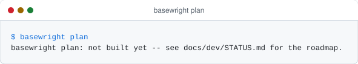

# Basewright

**Automated provisioning of database instances on servers that already exist.**

[](https://github.com/danmorcov88/Basewright/actions/workflows/ci.yml)
[](LICENSE)
[](pyproject.toml)
[](docs/dev/STATUS.md)

[Why](#why-basewright) · [How it works](#how-it-works) · [The one rule](#the-one-rule) ·
[Quickstart](#quickstart) · [Engines](#supported-engines) ·
[Writing a profile](#writing-a-profile) · [Contributing](.github/CONTRIBUTING.md)

---

## Why Basewright

> **An install that finished is not the same thing as an instance fit for production.**

Package managers already install databases. The hard part was never `apt install
postgresql-16`. The hard part is deciding whether *this* machine can carry *this* engine at
all, sizing memory and storage for the hardware in front of you, doing it identically on the
fortieth server as on the first, and being able to say six months later *why*
`shared_buffers` is 8 GB on that host.

Basewright treats those four things as the product and the installation itself as a
mechanical step at the end.

The workflow it replaces is a familiar one: the infrastructure team builds a VM and hands
over an IP; someone from the database team then logs in, inspects the machine by hand,
decides which engine version fits, and installs it — differently every time, depending on
who did it and how busy they were. Nothing afterwards records what was decided or why.
Reproducing the environment means reading someone's shell history.

A provisioning job that exits zero tells you a package was installed. It tells you nothing
about whether the instance is sane. Basewright refuses to conflate the two: a host that
fails preflight is reported as **refused, with a reason**, never as a degraded partial
install.

<picture>
  <source media="(prefers-color-scheme: dark)" srcset="docs/assets/finished-vs-fit-dark.svg">
  
</picture>

## How it works

Five steps, always in this order, each separately runnable:

<picture>
  <source media="(prefers-color-scheme: dark)" srcset="docs/assets/pipeline-dark.svg">
  
</picture>

| Step          | What it does                                                              | Changes the target? |
| ------------- | ------------------------------------------------------------------------- | ------------------- |
| **gather**    | Collects facts: OS, CPU, RAM, disks, mounts, ports, existing engines      | No                  |
| **preflight** | Runs the gate rules against facts and request; PASS / WARN / BLOCK        | No                  |
| **plan**      | Renders the full intended end state, every value annotated with its rule  | No                  |
| **apply**     | Executes the plan, idempotently                                           | Yes                 |
| **verify**    | Reads the live instance back and compares it to the plan                  | No                  |

`plan` is the centre of the product, and it is a file. It can be reviewed by a second
person, committed to Git, attached to a change request, and diffed against the plan from
three months ago. A provisioning tool where the reasoning lives only in the operator's head
is the thing being replaced.

The rendering below is the shape that artifact takes. It is a specification, not a capture:
the planner is still being built, and this section is replaced with real generated output —
the same way every other image here is generated — as soon as `plan` produces one.

```
Basewright plan — db-prod-07.internal
  generated 2026-09-03T10:14:22Z by basewright 0.4.1 · plan id 7f3a91

REQUEST
  engine            postgresql 16          (requested explicitly)
  environment       production
  instance          gitrez

HOST
  os                Ubuntu 24.04.1 LTS · x86_64 · kernel 6.8.0
  cpu               8 cores
  memory            32.0 GiB
  storage           /var/lib  512 GiB free · SSD
                    /backup   2.0 TiB free · HDD
  time sync         chrony, synchronized

PREFLIGHT                                                        14 pass · 2 warn · 0 block
  WARN  disk.separate_wal    WAL would share a mount with data
                             → performance and failure isolation are reduced
  WARN  os.thp               transparent huge pages = always
                             → apply will set it to madvise (reboot-persistent)

PARAMETERS
  shared_buffers            8GB        pg.shared_buffers      25% of 32GiB, capped at 8GB
  effective_cache_size      22GB       pg.effective_cache_size
  maintenance_work_mem      2GB        pg.maintenance_work_mem
  work_mem                  10MB       pg.work_mem
  max_connections           200        pg.max_connections
  random_page_cost          1.1        pg.random_page_cost    SSD detected
  effective_io_concurrency  200        pg.effective_io_concurrency
  huge_pages                try        pg.huge_pages          RAM >= 32GB

LAYOUT
  data      /var/lib/basewright/postgresql/gitrez/data     0700  postgres:postgres
  wal       /var/lib/basewright/postgresql/gitrez/wal      0700  postgres:postgres
  log       /var/log/basewright/postgresql/gitrez          0750  postgres:postgres
  backup    /backup/postgresql/gitrez                      0750  postgres:postgres

CHANGES apply WOULD MAKE
  + add apt repository apt.postgresql.org (pgdg)
  + install postgresql-16, postgresql-client-16, postgresql-contrib-16
  + create service account postgres (uid auto)
  + create 4 directories
  + initdb --data-checksums --locale=en_US.UTF-8 --encoding=UTF8
  + write postgresql.conf (23 parameters), pg_hba.conf (3 rules)
  ~ set vm.swappiness 60 → 10
  ~ set transparent_hugepage always → madvise
  + enable and start postgresql@16-gitrez

  nothing existing is removed or overwritten.

RESULT  plan is applicable · 2 warnings require acknowledgement (--accept-warnings)
```

Three properties make that artifact worth having:

- **A block produces no plan.** It produces a refusal naming the failing rule, the observed
  value, the required value, and what would have to change. There is no partial plan and no
  `--force`.
- **Warnings must be acknowledged explicitly** before `apply` will run. Silent warnings
  become invisible within a month.
- **The plan is deterministic.** The same facts and the same profiles produce byte-identical
  output, which is what makes golden-file review of tuning decisions possible.

`verify` closes the loop: `apply` promised something, `verify` proves it, and it can be run
again months later against any host Basewright provisioned. A verify failure is loud,
because it means the instance is no longer what the documentation claims it is.

## The one rule

**Core logic never branches on an engine name. Engines are data.**

There is no `if engine == "postgresql"` in the planner, the gate engine or the reporter.
Everything engine-specific lives in a profile: a directory of declarative files plus one
thin apply role.

```
profiles/postgresql/
├── profile.yml           # identity, families, defaults
├── support-matrix.yml    # engine version × OS × arch × EOL date
├── requirements.yml      # preflight rules and thresholds for this engine
├── layout.yml            # filesystem layout: data, log, backup, config, tmp
├── sizing.yml            # parameter rules, each with an id and an explanation
├── packages.yml          # repos, package names and service names per OS family
├── verify.yml            # post-install assertions
└── templates/            # config templates
```

Adding an engine means adding a directory. It never means editing the core. If the core
would need to know the engine name to behave correctly, the missing information belongs in
the profile schema instead — the schema gets extended, not the conditionals.

The rule is enforced rather than merely intended. CI scans every line of `basewright/`,
comments and docstrings included, and fails on an engine name. Profiles are validated
against a JSON Schema in which an unknown key is an error, so a profile cannot smuggle in
behaviour the core does not understand. A second engine ships specifically to prove the
abstraction holds, because one engine proves nothing.

Every sizing rule carries its own justification, and that justification is rendered into the
plan next to the computed value:

```yaml
- id: pg.shared_buffers
  parameter: shared_buffers
  expr: "0.25 * mem_total"
  min: "128MB"
  max: "8GB"
  why: "25% of RAM is the standard starting point; capped at 8GB because beyond that
        the OS page cache is the better place for the memory."
```

A number without a reason is exactly the situation Basewright exists to end.

## Quickstart

Not yet — and the honest version of that is worth showing rather than describing. Every
terminal image in this repository is produced by running the command and keeping what it
printed, so a verb that is not built renders as a verb that is not built:

<picture>
  <source media="(prefers-color-scheme: dark)" srcset="docs/assets/cli-plan-dark.svg">
  
</picture>

The five verbs exist as an interface already:

<picture>
  <source media="(prefers-color-scheme: dark)" srcset="docs/assets/cli-help-dark.svg">
  
</picture>

This section fills in with the real console output of each step as the roadmap closes. It
cannot fall behind: `tools/render_assets.py --check` regenerates every image in CI and fails
the build if what is committed differs by a single byte. Progress is tracked in
[docs/dev/STATUS.md](docs/dev/STATUS.md).

## Supported engines

| Engine        | OS families     | Status         |
| ------------- | --------------- | -------------- |
| PostgreSQL    | Debian / Ubuntu | in development |
| PostgreSQL    | RHEL / Rocky    | planned        |
| MySQL/MariaDB | Debian / Ubuntu | planned        |
| SQL Server    | Windows         | planned        |

Nothing in that table is finished. See [docs/dev/STATUS.md](docs/dev/STATUS.md) for what is
actually merged.

## Writing a profile

The profile is the contribution surface: adding an engine, an OS family or a tuning rule is
a change to `profiles/`, reviewable by a DBA rather than by a programmer. The guide lives in
`docs/dev/writing-a-profile.md` and is written alongside the schema it documents.

## Repository layout

```
basewright/
├── basewright/                  # Python: the part that decides
│   ├── facts/                   # normalize raw facts into a typed model
│   ├── profiles/                # loader + JSON Schema validation
│   ├── preflight/               # gate engine, severity resolution
│   ├── planner/                 # sizing evaluation, layout resolution, plan assembly
│   ├── report/                  # human and JSON rendering, shared by plan and verify
│   └── cli.py                   # thin: basewright gather|preflight|plan|verify
├── ansible/                     # Ansible: the part that acts
│   ├── playbooks/               # preflight.yml, plan.yml, apply.yml, verify.yml
│   ├── roles/                   # common, then one thin role per engine
│   ├── plugins/                 # action/filter plugins bridging to the Python package
│   └── inventory/example/
├── profiles/                    # engine data — the extension point
├── schema/                      # JSON Schema for every profile file and for plan.json
├── deploy/semaphore/            # template definitions + setup guide
├── test/
│   ├── unit/                    # pytest: facts, gates, sizing, rendering
│   ├── golden/                  # fixture facts → expected plan output
│   └── molecule/                # role tests in containers
└── docs/
    ├── adr/                     # architecture decisions
    └── dev/                     # writing-a-profile.md, STATUS.md, runbook.md
```

The design split is worth stating plainly: **Ansible decides nothing, Python decides
everything.** Sizing arithmetic and gate evaluation in Jinja templates would be untestable
and unreadable. Ansible executes a plan that has already been made.

<picture>
  <source media="(prefers-color-scheme: dark)" srcset="docs/assets/decides-acts-dark.svg">
  
</picture>

## Development

```
make install       # install the package and development dependencies
make lint          # ruff, mypy, yamllint
make test          # pytest, unit and golden suites, with coverage
make schema        # validate every profile against the profile JSON Schema
make guard         # fail if an engine name leaks into the core
make assets        # regenerate the diagrams and terminal captures in docs/assets/
make assets-check  # fail if a committed image is stale
make molecule      # run the Ansible role tests in containers (slow)
make all           # everything CI runs on a pull request, except molecule
```

Every image in this README is generated by `tools/render_assets.py` and by nothing else,
in a light and a dark variant. Diagrams are drawn from the same description of the
architecture the prose uses; terminal images are captured by running the command. Neither
can drift, because CI regenerates both and compares them byte for byte with what is
committed — a stale picture fails the build the way a stale test does.

Architecture decisions are recorded in [docs/adr/](docs/adr/), including why the plan is a
durable artifact, why there are only two gate severities, why Semaphore is the interface,
and why backups are somebody else's job.

## Project status

| Phase          | Contents                                                    | Status      |
| -------------- | ----------------------------------------------------------- | ----------- |
| **Foundation** | Schema, loader, fact model, gate engine, planner, CI        | in progress |
| **Phase A**    | PostgreSQL on Debian/Ubuntu, end to end                     | not started |
| **Phase B**    | RHEL/Rocky, Semaphore templates, plan storage               | not started |
| **Phase C**    | A second engine, proving the core needed no changes         | not started |
| **Phase D**    | Windows and SQL Server                                      | not started |
| **Phase E**    | Audit trail, plan diff against a live host, signed releases | not started |

Detail, and the placeholder values that still need real numbers from the estate, are in
[docs/dev/STATUS.md](docs/dev/STATUS.md).

## What Basewright is not

Permanently out of scope. This list is the reason the tool stays finishable:

- **Creating VMs, networks, storage or DNS.** Basewright starts at a reachable host.
- **Backup scheduling, verification or restore.** That is a separate tool's job.
- **A monitoring stack.** An exporter can be installed as an optional role; Prometheus and
  Grafana are not Basewright's to run.
- **Application schema deployment or data migration.**
- **Managed cloud databases.** RDS, Azure SQL and Cloud SQL are provisioned by their own
  APIs and have no server to inspect.
- **Major-version upgrades of an existing instance.** Different problem, different risks.
- **A custom web UI.** Semaphore already provides scheduling, RBAC, a secret store, task
  history and logs. Building a second one is how this project would die.

## License

Apache-2.0. See [LICENSE](LICENSE).
