# Basewright

**Automated provisioning of database instances on servers that already exist.**

[](https://github.com/danmorcov88/Basewright/actions/workflows/ci.yml)
[](LICENSE)
[](pyproject.toml)
[](docs/dev/STATUS.md)

[Why](#why-basewright) · [How it works](#how-it-works) · [The one rule](#the-one-rule) ·
[Quickstart](#quickstart) · [Engines](#supported-engines) ·
[Writing a profile](#writing-a-profile) · [Contributing](.github/CONTRIBUTING.md)

---

## Why Basewright

> **An install that finished is not the same thing as an instance fit for production.**

Package managers already install databases. The hard part was never `apt install
postgresql-16`. The hard part is deciding whether *this* machine can carry *this* engine at
all, sizing memory and storage for the hardware in front of you, doing it identically on the
fortieth server as on the first, and being able to say six months later *why*
`shared_buffers` is 8 GB on that host.

Basewright treats those four things as the product and the installation itself as a
mechanical step at the end.

The workflow it replaces is a familiar one: the infrastructure team builds a VM and hands
over an IP; someone from the database team then logs in, inspects the machine by hand,
decides which engine version fits, and installs it — differently every time, depending on
who did it and how busy they were. Nothing afterwards records what was decided or why.
Reproducing the environment means reading someone's shell history.

A provisioning job that exits zero tells you a package was installed. It tells you nothing
about whether the instance is sane. Basewright refuses to conflate the two: a host that
fails preflight is reported as **refused, with a reason**, never as a degraded partial
install.

<picture>
  <source media="(prefers-color-scheme: dark)" srcset="docs/assets/finished-vs-fit-dark.svg">
  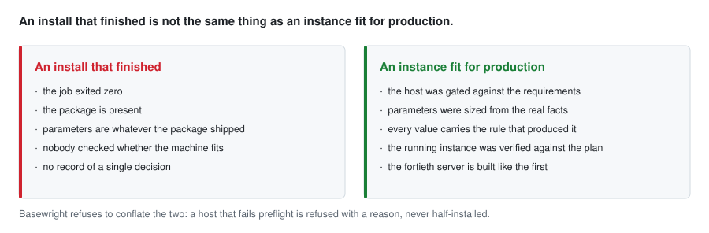
</picture>

## How it works

Five steps, always in this order, each separately runnable:

<picture>
  <source media="(prefers-color-scheme: dark)" srcset="docs/assets/pipeline-dark.svg">
  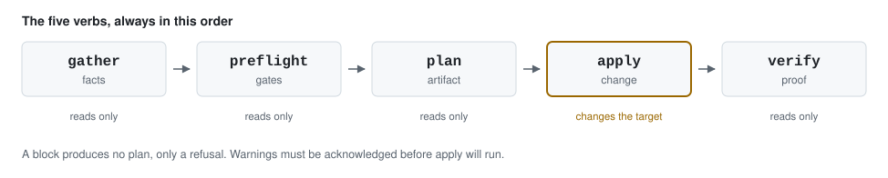
</picture>

| Step          | What it does                                                              | Changes the target? |
| ------------- | ------------------------------------------------------------------------- | ------------------- |
| **gather**    | Collects facts: OS, CPU, RAM, disks, mounts, ports, existing engines      | No                  |
| **preflight** | Runs the gate rules against facts and request; PASS / WARN / BLOCK        | No                  |
| **plan**      | Renders the full intended end state, every value annotated with its rule  | No                  |
| **apply**     | Executes the plan, idempotently                                           | Yes                 |
| **verify**    | Reads the live instance back and compares it to the plan                  | No                  |

`plan` is the centre of the product, and it is a file. It can be reviewed by a second
person, committed to Git, attached to a change request, and diffed against the plan from
three months ago. A provisioning tool where the reasoning lives only in the operator's head
is the thing being replaced.

The artifact exists and its contract is frozen. Here is what it carries, and which step
reads each part:

<picture>
  <source media="(prefers-color-scheme: dark)" srcset="docs/assets/plan-anatomy-dark.svg">
  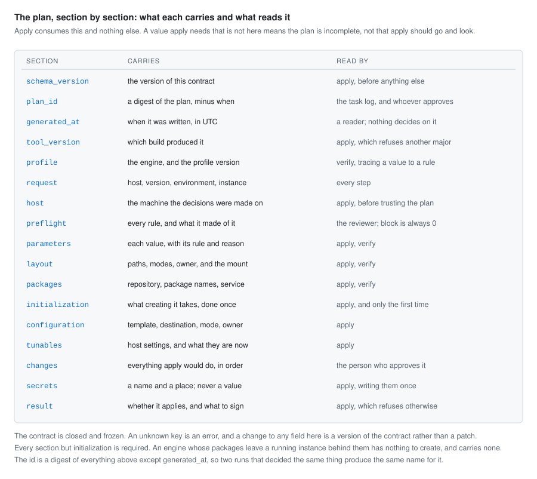
</picture>

And here is one, rendered for the person who has to approve it. Every value carries the
rule that produced it and the reasoning that rule ships with:

```
basewright plan --from test/golden/plan/typical.json
```

<picture>
  <source media="(prefers-color-scheme: dark)" srcset="docs/assets/plan-rendered-dark.svg">
  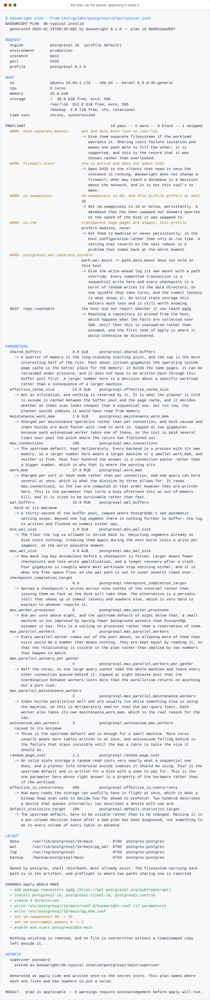
</picture>

Three properties make that artifact worth having:

- **A block produces no plan.** It produces a refusal naming the failing rule, the observed
  value, the required value, and what would have to change. There is no partial plan and no
  `--force`.
- **Warnings must be acknowledged explicitly** before `apply` will run. Silent warnings
  become invisible within a month.
- **The plan is deterministic.** The same facts and the same profiles produce byte-identical
  output, which is what makes golden-file review of tuning decisions possible.

`verify` closes the loop: `apply` promised something, `verify` proves it, and it can be run
again months later against any host Basewright provisioned. A verify failure is loud,
because it means the instance is no longer what the documentation claims it is.

## The one rule

**Core logic never branches on an engine name. Engines are data.**

There is no `if engine == "postgresql"` in the planner, the gate engine or the reporter.
Everything engine-specific lives in a profile: a directory of declarative files plus one
thin apply role.

<picture>
  <source media="(prefers-color-scheme: dark)" srcset="docs/assets/profile-anatomy-dark.svg">
  
</picture>

Adding an engine means adding a directory. It never means editing the core. If the core
would need to know the engine name to behave correctly, the missing information belongs in
the profile schema instead — the schema gets extended, not the conditionals.

The rule is enforced rather than merely intended. CI scans every line of `basewright/`,
comments and docstrings included, and fails on an engine name. Profiles are validated
against a JSON Schema in which an unknown key is an error, so a profile cannot smuggle in
behaviour the core does not understand. A second engine ships specifically to prove the
abstraction holds, because one engine proves nothing.

Every sizing rule carries its own justification, and that justification is rendered into the
plan next to the computed value:

```yaml
- id: pg.shared_buffers
  parameter: shared_buffers
  expr: "0.25 * mem_total"
  min: "128MB"
  max: "8GB"
  why: "25% of RAM is the standard starting point; capped at 8GB because beyond that
        the OS page cache is the better place for the memory."
```

A number without a reason is exactly the situation Basewright exists to end. Here is one
real value, from the rule that produced it to the line it occupies in a plan:

<picture>
  <source media="(prefers-color-scheme: dark)" srcset="docs/assets/sizing-journey-dark.svg">
  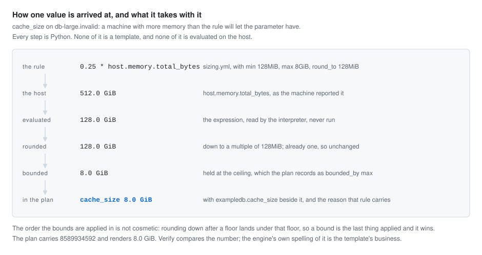
</picture>

## Quickstart

**Not yet a quickstart, and it says so rather than pretending.** No engine profile ships in
this repository — `profiles/` is empty until Phase A — so there is nothing here you can point
at a server and provision. What follows is a walkthrough of the three verbs that work,
against documents committed under `test/`, which is as much as exists today.

Every command below is copy-pasteable after `make install`, and every one of them is the
command that produced the picture underneath it: `tools/render_assets.py` runs them to make
the images, and a test holds the text in this file against the commands it ran. Neither can
drift from the other.

`gather` reads what a host reported and normalizes it into the model every rule is written
against:

```
basewright gather --facts test/fixtures/hosts/typical.json
```

<picture>
  <source media="(prefers-color-scheme: dark)" srcset="docs/assets/cli-gather-dark.svg">
  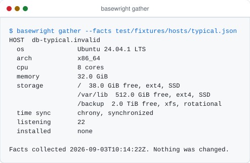
</picture>

Where that document comes from is a playbook. `ansible/playbooks/gather.yml` reaches the
host, reads it, writes the document, and then hands it straight back to the verb above:

```
ansible-playbook ansible/playbooks/gather.yml -l db-01.example.invalid
```

The host below is a real one — a container the role went and read during the test run that
produced this page, committed as it came off the wire. It is not a fixture somebody wrote
to make a point:

```
basewright gather --facts test/fixtures/hosts/collected.json
```

<picture>
  <source media="(prefers-color-scheme: dark)" srcset="docs/assets/cli-collected-dark.svg">
  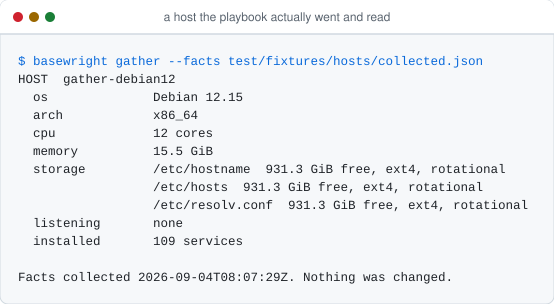
</picture>

The playbook is the entry point and the CLI never reaches a machine — not
`basewright gather --host db-01` with Ansible underneath it, which is what most tools in
this space do:

<picture>
  <source media="(prefers-color-scheme: dark)" srcset="docs/assets/verb-pipeline-dark.svg">
  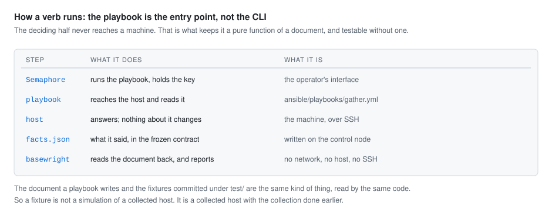
</picture>

That split is the reason the deciding half stays a pure function of a document: it has no
connection handling, no inventory, no host key policy, and its tests need no network. The
argument, including the case for the obvious alternative, is in
[ADR-0020](docs/adr/0020-the-playbook-is-the-entry-point.md).

`preflight` puts twenty engine-independent rules, and every rule the profile adds, to that
host. A refusal is a first-class outcome, so it is an answer rather than an error: it names
the rule, what was found, what was required, and what would have to change.

```
basewright preflight --facts test/fixtures/hosts/crowded.json --profile test/fixtures/profiles/exampledb
```

<picture>
  <source media="(prefers-color-scheme: dark)" srcset="docs/assets/preflight-refused-dark.svg">
  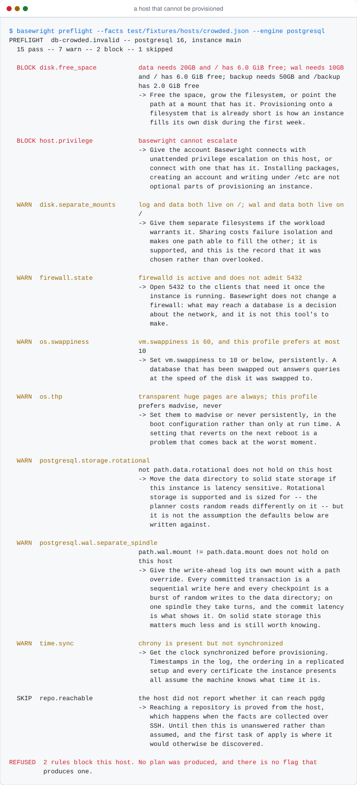
</picture>

There is no flag that turns any of that into a plan. A host that passes still reports what
it is not happy about, and those warnings are acknowledged before apply will run:

```
basewright preflight --facts test/fixtures/hosts/typical.json --profile test/fixtures/profiles/exampledb
```

<picture>
  <source media="(prefers-color-scheme: dark)" srcset="docs/assets/preflight-passed-dark.svg">
  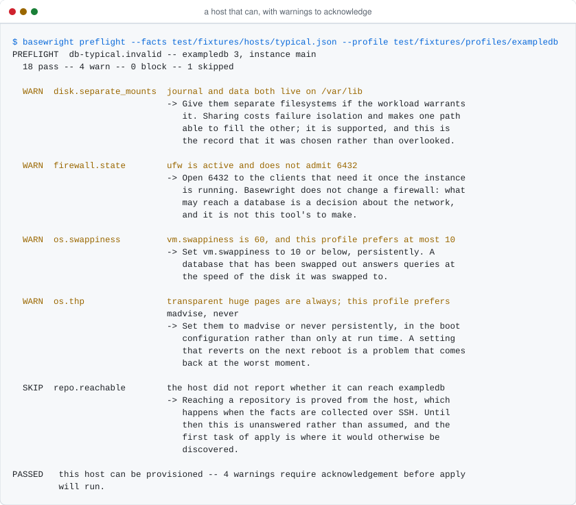
</picture>

`plan` runs those rules again, refuses outright if any of them blocks, and otherwise sizes
every parameter, resolves the layout and works out everything `apply` would do. The
rendering above is what it prints; `--json` writes the artifact itself.

A plan is named after a digest of its own content, which makes the name a checksum as well
as a name. `plan --from` reads one back — which is how the person who applies a plan can be
somebody other than the person who produced it — and says so when the two no longer agree:

```
basewright plan --from test/fixtures/plan/edited.json
```

<picture>
  <source media="(prefers-color-scheme: dark)" srcset="docs/assets/plan-edited-dark.svg">
  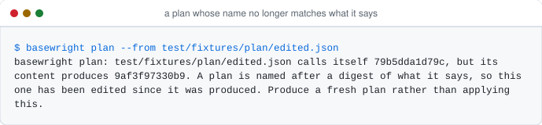
</picture>

`verify` is still a promise, and says so rather than hanging or pretending. It reads a live
instance and compares it to the plan it came from, which needs a machine to reach — Ansible's
half of the split, and Phase A:

```
basewright verify
```

<picture>
  <source media="(prefers-color-scheme: dark)" srcset="docs/assets/cli-verify-dark.svg">
  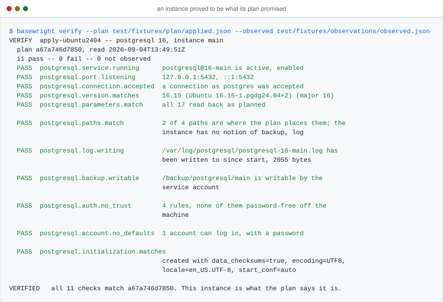
</picture>

`apply` is not a verb of this CLI at all, and never will be: applying is Ansible's job, and
the plan is the boundary between them. Four verbs exist as an interface already:

```
basewright --help
```

<picture>
  <source media="(prefers-color-scheme: dark)" srcset="docs/assets/cli-help-dark.svg">
  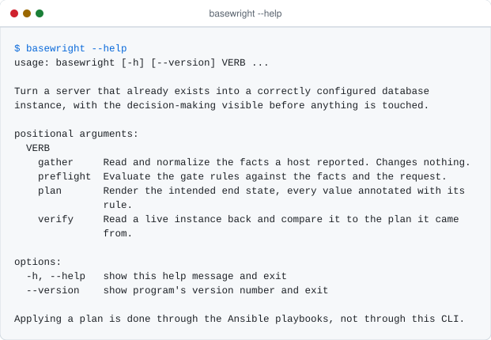
</picture>

This section fills in with the real console output of each step as the roadmap closes. It
cannot fall behind: `tools/render_assets.py --check` regenerates every image in CI and fails
the build if what is committed differs by a single byte. Progress is tracked in
[docs/dev/STATUS.md](docs/dev/STATUS.md).

### What a run exits with

Semaphore is the interface
([ADR-0005](docs/adr/0005-semaphore-is-the-interface.md)), and its view of a run is one bit:
the task is green or the task is red. So the exit code is not how a failure gets
reported — the report already does that, in the task log. What the number carries is what
the person looking at a red task is supposed to do next, and there are four answers worth
telling apart:

| Code | What happened | What to do |
| ---- | ------------- | ---------- |
| `0` | The tool ran, and the answer is yes. | Go on to the next step. |
| `2` | The tool ran, and the answer is no. | Read the report: it names the rule, what was found, and the way out. |
| `64` | The request itself is malformed. | Fix the command. Nothing was decided, so there is no report to read. |
| `69` | The verb exists and is not built yet. | Nothing yet. docs/dev/STATUS.md says what is built. |

<picture>
  <source media="(prefers-color-scheme: dark)" srcset="docs/assets/exit-codes-dark.svg">
  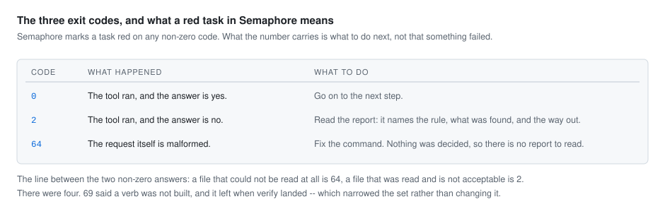
</picture>

The line between the two non-zero answers is where a document stopped being readable: **a
file that could not be read at all is `64`, and a file that was read and is not acceptable
is `2`.** A missing facts document is a mistyped path; one that fails its contract is a real
answer about a real file. A plan whose id no longer matches its content is `2` for the same
reason — it is a plan, it is simply not the plan it claims to be.

A blocked gate, an unacceptable document and, when it lands, a verify mismatch are all `2`.
They differ in what happened, not in what to do about it, and the difference between them
lives in the report rather than in a number. The set is closed, held by a test in both
directions, and argued in [ADR-0019](docs/adr/0019-exit-codes-are-the-contract.md).

### What a host is, to a rule

Facts are normalized before anything reads them, so a change in how they are collected
cannot ripple into the gate engine or the planner. The model carries what the rules need in
order to reach a verdict, and nothing else:

<picture>
  <source media="(prefers-color-scheme: dark)" srcset="docs/assets/facts-model-dark.svg">
  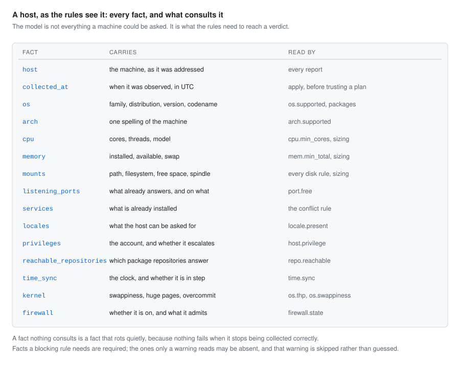
</picture>

The collector reports which packaging family the operating system belongs to; the core
never infers it. Working out that one distribution is packaged like another is knowledge
about operating systems, and it belongs where the observation is made — the same reason no
engine name appears in the core.

## Supported engines

| Engine        | OS families     | Status         |
| ------------- | --------------- | -------------- |
| PostgreSQL    | Debian / Ubuntu | in development |
| PostgreSQL    | RHEL / Rocky    | planned        |
| MySQL/MariaDB | Debian / Ubuntu | planned        |
| SQL Server    | Windows         | planned        |

Nothing in that table is finished. See [docs/dev/STATUS.md](docs/dev/STATUS.md) for what is
actually merged.

## Writing a profile

The profile is the contribution surface: adding an engine, an OS family or a tuning rule is
a change to `profiles/`, reviewable by a DBA rather than by a programmer. The guide is
[docs/dev/writing-a-profile.md](docs/dev/writing-a-profile.md), written alongside the schema
it documents.

Checking a profile is one command, and it reports everything wrong at once — the file, the
place inside it, and what to do about it:

```
python -m basewright.profiles test/fixtures/profiles/malformed
```

<picture>
  <source media="(prefers-color-scheme: dark)" srcset="docs/assets/profile-refused-dark.svg">
  
</picture>

The remedy in each of those messages is the schema's own description of the field, so the
specification and the error message cannot drift apart: they are the same string. Beyond
the schema, the loader checks the agreements between files that no single schema can see —
that every file names the same engine, that the default version is one that exists, that
every OS family used is declared and can be installed on, and that no identifier is used
twice.

## Repository layout

```
basewright/
├── basewright/                  # Python: the part that decides
│   ├── facts/                   # normalize raw facts into a typed model
│   ├── profiles/                # loader + JSON Schema validation
│   ├── preflight/               # gate engine, severity resolution
│   ├── planner/                 # sizing evaluation, layout resolution, plan assembly
│   ├── report/                  # human and JSON rendering, shared by plan and verify
│   └── cli.py                   # thin: basewright gather|preflight|plan|verify
├── ansible/                     # Ansible: the part that acts
│   ├── playbooks/               # preflight.yml, plan.yml, apply.yml, verify.yml
│   ├── roles/                   # common, then one thin role per engine
│   ├── plugins/                 # action/filter plugins bridging to the Python package
│   └── inventory/example/
├── profiles/                    # engine data — the extension point
├── schema/                      # JSON Schema for every profile file and for plan.json
├── deploy/semaphore/            # template definitions + setup guide
├── test/
│   ├── unit/                    # pytest: facts, gates, sizing, rendering
│   ├── golden/                  # fixture facts → expected plan output
│   └── molecule/                # role tests in containers
└── docs/
    ├── adr/                     # architecture decisions
    └── dev/                     # writing-a-profile.md, STATUS.md, runbook.md
```

The design split is worth stating plainly: **Ansible decides nothing, Python decides
everything.** Sizing arithmetic and gate evaluation in Jinja templates would be untestable
and unreadable. Ansible executes a plan that has already been made.

<picture>
  <source media="(prefers-color-scheme: dark)" srcset="docs/assets/decides-acts-dark.svg">
  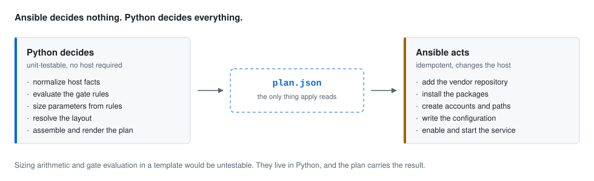
</picture>

## Development

```
make install       # install the package and development dependencies
make lint          # ruff, mypy, yamllint
make test          # pytest, unit and golden suites, with coverage
make schema        # validate every profile against the profile JSON Schema
make guard         # fail if an engine name leaks into the core or a shared role
make assets        # regenerate the diagrams and terminal captures in docs/assets/
make assets-check  # fail if a committed image is stale
make golden        # regenerate the golden plans, then read the diff
make golden-check  # fail if a committed golden plan is stale
make ansible-lint  # lint every playbook, role and scenario
make molecule      # run the role tests against real containers (slow, needs Docker)
make all           # everything CI runs on a pull request, except molecule
```

`make molecule` builds a container per platform, brings systemd up inside it and runs the
collecting role against it for real. That is slower than the rest of the suite put together
and it is the only thing here that proves the collector and a machine still agree, so it
runs on every pull request rather than on a schedule.

One command is worth knowing on its own, because it is what a profile author runs:

```
python -m basewright.profiles profiles/<engine>
```

It is not a fifth verb — the verbs act on a host, this acts on the repository.

Every image in this README is generated by `tools/render_assets.py` and by nothing else,
in a light and a dark variant. Diagrams are drawn from the same description of the
architecture the prose uses; terminal images are captured by running the command. Neither
can drift, because CI regenerates both and compares them byte for byte with what is
committed — a stale picture fails the build the way a stale test does.

## Architecture decisions

Twenty decisions are recorded in [docs/adr/](docs/adr/), each with the context that forced
it, what it costs, and the alternatives that were rejected. The four that shape everything
else:

<picture>
  <source media="(prefers-color-scheme: dark)" srcset="docs/assets/decisions-dark.svg">
  
</picture>

- [ADR-0001](docs/adr/0001-plan-before-apply.md) — the plan comes before the change, and it
  is a file somebody can review.
- [ADR-0002](docs/adr/0002-engines-are-data.md) — engines are data, so adding one never
  edits the core.
- [ADR-0004](docs/adr/0004-two-severities-no-override.md) — two severities, and no way to
  override a block at run time. The most arguable of them, and the record makes the case
  against itself.
- [ADR-0008](docs/adr/0008-python-decides-ansible-acts.md) — Python decides, Ansible acts,
  and the plan is the boundary.

The rest cover how a version is chosen
([0003](docs/adr/0003-humans-choose-the-version.md)), why the interface is Semaphore
([0005](docs/adr/0005-semaphore-is-the-interface.md)), how targets are reached
([0006](docs/adr/0006-dedicated-technical-account.md)) and how credentials are kept out of
every artifact ([0007](docs/adr/0007-secrets-never-in-artifacts.md)), why every sizing rule
carries its own justification ([0009](docs/adr/0009-sizing-rules-explain-themselves.md)),
what a second run is allowed to do ([0010](docs/adr/0010-idempotency-match-or-refuse.md)),
where packages come from ([0011](docs/adr/0011-native-packages-from-vendors.md)), and the two
boundaries that keep the scope finishable —
[0012](docs/adr/0012-starts-at-a-reachable-host.md) and
[0013](docs/adr/0013-backups-are-out-of-scope.md).

## Project status

| Phase          | Contents                                                    | Status      |
| -------------- | ----------------------------------------------------------- | ----------- |
| **Foundation** | Schema, loader, fact model, gate engine, planner, report, CI | complete   |
| **Phase A**    | PostgreSQL on Debian/Ubuntu, end to end                     | in progress |
| **Phase B**    | RHEL/Rocky, Semaphore templates, plan storage               | not started |
| **Phase C**    | A second engine, proving the core needed no changes         | not started |
| **Phase D**    | Windows and SQL Server                                      | not started |
| **Phase E**    | Audit trail, plan diff against a live host, signed releases | not started |

Foundation is complete and it closes with `verify` unbuilt, which is worth stating plainly
rather than leaving to be discovered. Verify reads a live instance and compares it to the
plan it came from, so it needs an instance to exist — which is the end of Phase A, not the
start of it. It exists as a verb, it exits `69`, and it says which page to read.

Phase A has started with the half of it that needs nothing from anybody: `gather` now reads
a real host, because collecting facts is engine-independent. Everything after that is
blocked on information rather than on code. Seven conventions have to come from
the estate before a first engine profile can ship — path layout, service account, locale,
authentication rules, the minimum resources a production instance may run on, the OS
families actually in use, and the port convention. The minimums become block thresholds
with no override, so they have to be numbers somebody will defend in a review. Until they
arrive, `profiles/` stays empty and the schema job in CI says so out loud instead of passing
quietly over an empty directory.

Detail, and the placeholder values that still need real numbers from the estate, are in
[docs/dev/STATUS.md](docs/dev/STATUS.md).

## What Basewright is not

Permanently out of scope. This list is the reason the tool stays finishable:

- **Creating VMs, networks, storage or DNS.** Basewright starts at a reachable host.
- **Backup scheduling, verification or restore.** That is a separate tool's job.
- **A monitoring stack.** An exporter can be installed as an optional role; Prometheus and
  Grafana are not Basewright's to run.
- **Application schema deployment or data migration.**
- **Managed cloud databases.** RDS, Azure SQL and Cloud SQL are provisioned by their own
  APIs and have no server to inspect.
- **Major-version upgrades of an existing instance.** Different problem, different risks.
- **A custom web UI.** Semaphore already provides scheduling, RBAC, a secret store, task
  history and logs. Building a second one is how this project would die.

## License

Apache-2.0. See [LICENSE](LICENSE).
