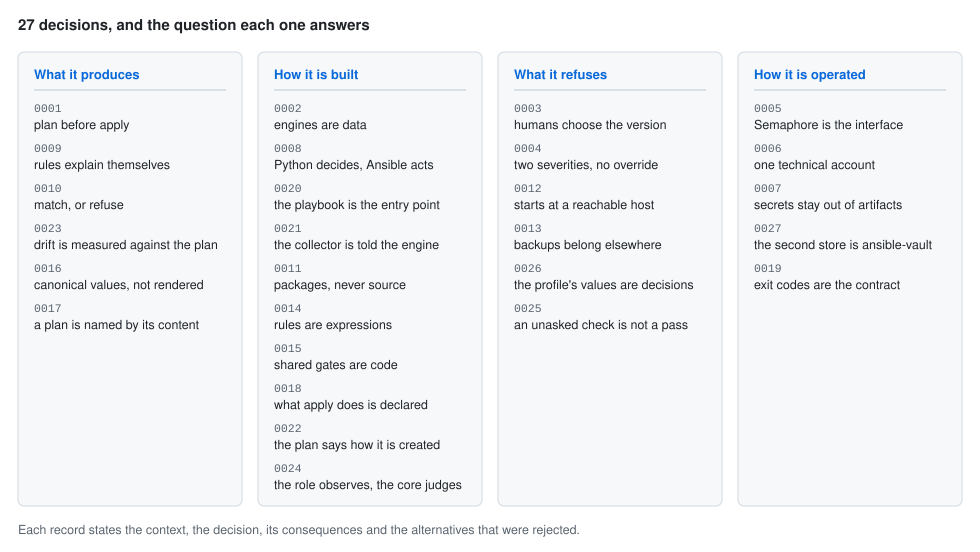

# Architecture decision records

The decisions this project is built on, each with the context that forced it, what was
decided, what it costs, and the alternatives that were rejected and why.

They are written because the alternatives are all reasonable. Nothing here was obvious at
the time, and several of them will look like the wrong call to a reader who has not seen the
argument — a gate with no override flag most of all. A record that only stated the decision
would be a rule; a record that states the case against it is something you can disagree with
on the merits, and supersede when the merits change.

<picture>
  <source media="(prefers-color-scheme: dark)" srcset="../assets/decisions-dark.svg">
  
</picture>

## The records

| #                                                               | Decision                                                             |
| ----------------------------------------------------------------- | ---------------------------------------------------------------------- |
| [0001](0001-plan-before-apply.md)                               | Plan before apply, and the plan is a durable artifact                |
| [0002](0002-engines-are-data.md)                                | Engines are data, not code                                           |
| [0003](0003-humans-choose-the-version.md)                       | Humans choose the version, Basewright validates it                   |
| [0004](0004-two-severities-no-override.md)                      | Two severities, and a block is never overridable at run time         |
| [0005](0005-semaphore-is-the-interface.md)                      | Semaphore is the interface; there is no custom web UI                |
| [0006](0006-dedicated-technical-account.md)                     | A dedicated technical account reaches targets, never personal keys   |
| [0007](0007-secrets-never-in-artifacts.md)                      | Secrets never appear in inventory, plans, facts or logs              |
| [0008](0008-python-decides-ansible-acts.md)                     | Python decides, Ansible acts                                         |
| [0009](0009-sizing-rules-explain-themselves.md)                 | Sizing rules are declarative and carry their own explanation         |
| [0010](0010-idempotency-match-or-refuse.md)                     | A re-run either matches or refuses, and never surprises              |
| [0011](0011-native-packages-from-vendors.md)                    | Native packages from vendor repositories; never build from source    |
| [0012](0012-starts-at-a-reachable-host.md)                      | Basewright starts at a reachable host                                |
| [0013](0013-backups-are-out-of-scope.md)                        | Backups are out of scope and belong to a separate tool               |
| [0014](0014-rules-are-expressions-not-code.md)                  | A rule a profile writes is an expression, safely interpreted         |
| [0015](0015-shared-gates-are-code.md)                           | The shared gates are code; a profile's gates are data                |
| [0016](0016-plans-carry-canonical-values.md)                    | A plan carries canonical values, not rendered ones                   |
| [0017](0017-a-plan-is-named-by-its-content.md)                  | A plan is named by its content                                       |
| [0018](0018-what-apply-will-do-is-declared.md)                  | What apply will do is declared, not inferred                         |
| [0019](0019-exit-codes-are-the-contract.md)                     | Exit codes are the contract with Semaphore                           |
| [0020](0020-the-playbook-is-the-entry-point.md)                 | The playbook is the entry point; the CLI reads documents             |
| [0021](0021-the-collector-is-told-what-is-being-provisioned.md) | The collector is told what is being provisioned, for one fact        |
| [0022](0022-the-plan-says-how-the-instance-is-created.md)       | The plan says how the instance is created; that made it version two  |
| [0023](0023-drift-is-measured-against-the-plan.md)              | Drift is measured against the plan, and free space is not part of it |

## Reading order

Three of them carry most of the weight, and the rest follow from them.

**[0001](0001-plan-before-apply.md)** is why the tool has five steps instead of one: the
plan is a file, produced before anything is touched, and it is the product.
**[0002](0002-engines-are-data.md)** is why adding an engine is a directory of YAML rather
than a change to the planner. **[0008](0008-python-decides-ansible-acts.md)** is the line
between the half that reasons and the half that acts, and the plan is where they meet.

**[0004](0004-two-severities-no-override.md)** is the one most likely to be argued with. It
says a failed gate cannot be overridden at the console — not with a flag, not with a
per-rule setting, not with a confirmation prompt — and the case against that position is
made in the record itself.

## What a record looks like

Five sections, and a test in `test/unit/test_decision_records.py` that fails the build if
one is missing:

- **Status** — accepted, and the date. Superseded records stay, with a pointer forward.
- **Context** — what made the decision necessary, including the pressures pushing the other
  way.
- **Decision** — what was decided, stated so that a reviewer can tell whether an
  implementation follows it.
- **Consequences** — what this buys and what it costs, with the costs stated as plainly as
  the benefits. A record with no costs section has not been thought about.
- **Rejected alternatives** — each with the argument for it and the reason it lost. This is
  the section worth reading.

The same test checks the numbering is contiguous and that every record appears on the
decision map above, so the picture cannot describe a set of decisions the repository does not
have.

## Adding one

A new record gets the next number, the same five sections, and an entry in the `DECISIONS`
map in `tools/render_assets.py` — the test will remind you if you forget the last part.

A decision that turns out to be wrong is superseded, not edited: the old record keeps its
number and its reasoning and gains a line pointing at the one that replaced it. The value of
these files is that they record what was believed at the time, which quietly rewriting them
would destroy.
