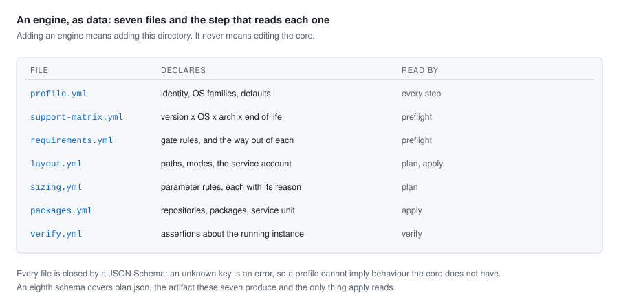
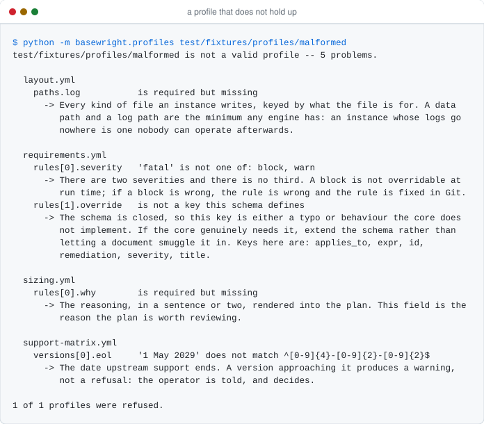

# Writing a profile

A profile is how Basewright learns an engine. It is eight YAML files and a directory of
templates, and it is the only place in the repository where knowledge of a particular
database lives. Nothing under `basewright/` knows the name of any engine, and nothing in
a profile is code — which is the point: a profile is reviewable by whoever knows the
database, rather than by whoever knows Python.

Adding an engine means adding a directory. If it ever seems to also mean editing the
core, that is a finding: the missing information belongs in the schema, and the schema
gets extended so the profile can supply it.

<picture>
  <source media="(prefers-color-scheme: dark)" srcset="../assets/profile-anatomy-dark.svg">
  
</picture>

## Where things live

```
profiles/<engine>/
├── profile.yml           # identity, OS families, defaults
├── support-matrix.yml    # engine version x OS x arch x end of life
├── requirements.yml      # gate rules this engine adds, and the way out of each
├── layout.yml            # paths, modes, the service account
├── sizing.yml            # parameter rules, each with its reason
├── packages.yml          # repositories, packages, service unit, per OS family
├── apply.yml             # configuration files, initialization, host settings, secrets
├── verify.yml            # assertions about the running instance
└── templates/            # configuration templates
```

Each file has a JSON Schema in [`schema/`](../../schema), and every object in every schema
is closed: an unknown key is an error rather than something quietly ignored. That is not
pedantry. A profile that can carry a key the core does not read is a profile that can
imply behaviour the core does not have, and the first person to find out is whoever runs
it against a production host.

## Checking your work

```
python -m basewright.profiles profiles/<engine>
```

This is not one of the four verbs — those act on a host, and this acts on the repository.
It reads the profile, validates each file against its schema, and then checks the
agreements *between* files that no single schema can see: that every file names the same
engine, that the default version is one of the versions listed, that every operating
system family used is declared and can actually be installed on, and that no identifier is
used twice.

Everything wrong is reported at once, with the file, the place inside it, and what to do
about it:

<picture>
  <source media="(prefers-color-scheme: dark)" srcset="../assets/profile-refused-dark.svg">
  
</picture>

The remedy in each of those messages is the schema's own description of the field. There
is one place to write down what a field is for, and both the schema and the refusal read
from it.

`make schema` runs the same check over every profile in the repository, and so does CI on
every pull request.

## The eight files

### `profile.yml` — identity

```yaml
---
engine: exampledb
display_name: ExampleDB
profile_version: "1.0.0"
summary: A fictional engine used to exercise the profile schema and the loader.
os_families:
  - debian
  - rhel
defaults:
  port: 6432
  instance: main
  locale: en_US.UTF-8
```

`os_families` is the single list of families the profile supports; the support matrix and
the package definitions are checked against it. `profile_version` is the version of the
profile, not of the engine, and it is carried into `plan.json` so that a value in an old
plan can be traced back to the rule that produced it.

`defaults.locale` is what the instance is initialized with. It is optional: an engine that
does not take one omits it, and the shared rule `locale.present` reports `skip` rather than
checking for a locale nobody asked for.

### `support-matrix.yml` — what may be installed where

Basewright never chooses a version. A human does, and this file is what that choice is
validated against.

```yaml
---
engine: exampledb
default_version: "3"
versions:
  - version: "3"
    eol: "2029-05-01"
    arch: [x86_64, aarch64]
    supported_os:
      - family: debian
        distro: ubuntu
        versions: ["22.04", "24.04"]
```

A version approaching its end of life produces a warning rather than a refusal: the
operator is told, and decides. `status: allowed_with_warning` marks a version that is
still maintained upstream but is not what a new instance should be built on.

### `requirements.yml` — what refuses a host, and what this engine adds

Twenty rules apply to every engine: the host has to be reachable and the account able to
escalate, the operating system and architecture have to be in the support matrix, there
have to be enough cores and enough memory, every path has to be on a writable mount with
enough space, the port has to be free, nothing conflicting may be installed, the repository
has to answer, the locale has to exist — and eight more that warn rather than refuse.

None of those rules holds a number. Every threshold they compare against is declared here,
and where a profile declares none the rule reports `skip` rather than inventing one
([ADR-0015](../adr/0015-shared-gates-are-code.md)).

```yaml
---
engine: exampledb
minimums:
  cores: 2
  memory: 2GB
preferences:
  filesystems: [ext4, xfs]
  transparent_hugepages: [madvise, never]
  max_swappiness: 10
conflicts:
  - service: exampledb
    match: prefix
    description: an instance of this engine, from the vendor packages
rules:
  - id: exampledb.port.unprivileged
    severity: block
    title: A port the service account can bind without privilege
    expr: request.port > 1024
    remediation: >-
      Choose a port above 1024. The service account this engine runs as is unprivileged
      and cannot bind a reserved port.
```

`minimums` and `preferences` mirror the two severities: what is under a minimum refuses the
host, and what falls short of a preference is reported and provisioned anyway.

`conflicts` is how `engine.not_installed` works at all. The core recognises no service by
name — it compares what the host reports against what is declared here. `match: prefix`
covers the per-version and per-instance units a package manager installs, so a profile
names the family once rather than enumerating it.

`rules` is what this engine adds on top. There are two severities and there is no third,
and there is no flag that turns a block into a warning: if a block is wrong, the rule is
wrong, and the rule is fixed in Git where a reviewer can see it. A rule ships with a test
for both of its outcomes.

`remediation` is not optional and is not decoration. "Refused because /backup has 2.0 GiB
free and this profile requires 50GB" is a useful answer; "preflight failed" is not.

#### What an `expr` may say

An expression is read by a small interpreter that cannot run anything
([ADR-0014](../adr/0014-rules-are-expressions-not-code.md)). The syntax is Python's, but
only part of it is a language here: constants, names, attributes, arithmetic, comparison,
`and` / `or` / `not`, a conditional expression, and tuples for membership tests. A call, a
subscript, a comprehension, a formatted string or exponentiation is refused when the profile
is read, with the column it appears at.

What an expression may read:

| Name             | Carries                                                            |
| ---------------- | ------------------------------------------------------------------ |
| `host`           | `os`, `arch`, `cpu`, `memory`, `kernel`, `time_sync`, `firewall`, `privileges`, `locales` |
| `request`        | `host`, `engine`, `version`, `environment`, `instance`, `port`, `chosen_version` |
| `path.<purpose>` | `path`, `mount`, `filesystem`, `free_bytes`, `total_bytes`, `rotational`, `read_only` |
| `profile`        | `engine`, `version`, `default_version`, `default_port`, `default_instance`, `locale` |
| units            | `B`, `KB`, `MB`, `GB`, `TB`, `PB`, and the binary `KiB` through `PiB` |
| `none`           | what an unset fact is compared against                              |

Two failures mean different things and are reported differently. A fact the contract defines
but this host did not report makes the rule report `skip` — a fact nobody collected is not a
host that fell short. A name the vocabulary does not define at all refuses the run, because
a misspelling that skipped quietly would be a gate that has stopped guarding.

`applies_to` is a second expression deciding whether the rule is evaluated at all. A rule
that does not apply reports `skip`:

```yaml
  - id: exampledb.storage.rotational
    severity: warn
    title: Data directory on rotational storage
    expr: not path.data.rotational
    applies_to: path.data.rotational is not none
    remediation: Move the data path to solid state storage if latency matters here.
```

### `layout.yml` — where the files go

```yaml
---
engine: exampledb
paths:
  data:
    default: /var/lib/basewright/{{ engine }}/{{ instance }}/data
    mode: "0700"
    min_free: 20GB
  journal:
    default: /var/lib/basewright/{{ engine }}/{{ instance }}/journal
    mode: "0700"
    min_free: 10GB
    prefer_separate_from: [data]
service_account:
  name: exampledb
  create_if_missing: true
  shell: /usr/sbin/nologin
```

Which purposes a profile defines is the engine's business; `data` and `log` are the two
every engine has. Each `min_free` becomes a block threshold, so it has to be a number
someone will defend in a review. It is quoted back in the refusal exactly as it is written
here, so `20GB` reads as `20GB` rather than being re-rendered as `18.6 GiB` and sending the
reader off to check whether those are the same number.

`prefer_separate_from` names the other purposes this path would rather not share a mount
with. Sharing only warns: two paths on one filesystem compete for the same free space and
the same queue and lose each other's failure isolation, but the instance runs. The purposes
named have to exist, which the loader checks — one that is not there reads as a rule about
storage and is silently no rule at all.

Placeholders in a path are substituted, and that is all that happens to it: `{{ engine }}`,
`{{ instance }}` and `{{ version }}`. Anything else is an error rather than a directory with
braces in its name.

### `sizing.yml` — the parameters, and why

```yaml
---
engine: exampledb
rules:
  - id: exampledb.cache_size
    parameter: cache_size
    expr: 0.25 * host.memory.total_bytes
    unit: bytes
    min: 128MiB
    max: 8GiB
    round_to: 128MiB
    why: >-
      A quarter of memory is the standard starting point for a shared cache, and it is
      capped because past that point the operating system page cache is the better place
      for the memory.
```

`why` is rendered into the plan next to the computed value. A number without a reason is
the situation this project exists to end, so the schema requires it.

The arithmetic is data here and is evaluated in Python, where it can be unit-tested
against fixture hosts — a machine with 2 GiB, one with 512 GiB, one with rotational disks.
A sizing rule ships with a golden fixture, so a change to it shows up as a readable diff in
the pull request rather than as a number that quietly moved. Two files are written per host:
the plan, and the plan as a person reads it, so a change to a value and a change to how it
reads are both diffs. Regenerate them with `make golden`, and read the diff before
committing it: that diff is the review of the decision, not a chore before the review.

Four things around the expression are worth knowing.

**A rule may read a parameter another rule sets.** `work_memory` can divide by
`max_connections`, wherever in the file that rule happens to be written. The order values
are computed in comes from what they read; the order the plan lists them in is the order
you wrote them. Two rules that each need the other's answer first are refused by name,
with the ring spelled out.

**Bounds are written with their unit, and the unit has to be the parameter's.** `128MiB`
for bytes, `30s` for seconds. A bare number is already in the parameter's unit. `8GB` and
`8GiB` are different numbers and both mean exactly what they say.

**Rounding happens before the bounds.** `round_to` snaps the value down to a multiple, and
then the floor and the ceiling are applied — in that order, because rounding down after a
floor lands underneath it. A bound that actually moved the value is recorded in the plan as
`bounded_by`, because a number held at its ceiling says something different about the
machine from one that arrived there.

**`warn_above` does not clamp.** It marks a value that is permitted but worth saying out
loud, and it joins the warnings `apply` has to have acknowledged. It is not a gate:
preflight finished before the parameter existed.

A rule that reads a fact the host did not report does not quietly produce no parameter. It
refuses the plan, naming the rule and the fact, because a plan with a hole in it is one
apply discovers halfway through.

### `packages.yml` — what to install, from where

```yaml
---
engine: exampledb
families:
  debian:
    repository:
      name: exampledb
      url: https://packages.example.invalid/apt
      key_url: https://packages.example.invalid/apt/signing.asc
      suite: "{{ os.codename }}"
      components: [main]
    packages:
      - exampledb-server-{{ version }}
    service: exampledb@{{ version }}-{{ instance }}
```

Native packages from vendor repositories. No compiling from source, no unpacking a tarball
into `/opt`. Plain HTTP is not accepted for a repository URL: a package repository reached
without transport security is a supply chain nobody controls.

Every family declared in `profile.yml` needs an entry here. A profile that claims a family
it cannot install on refuses at apply time, which is the latest possible moment to find
out.

### `apply.yml` — what apply will do to the machine

```yaml
---
engine: exampledb
configuration:
  - id: exampledb.server_config
    template: exampledb.conf.j2
    destination: /etc/basewright/{{ engine }}/{{ instance }}/exampledb.conf
    mode: "0640"
    carries_parameters: true
    description: The server configuration, where the sized parameters land.
initialization:
  description: >-
    Create the instance in the data directory the plan names, with the locale this host
    was already checked for.
  settings:
    - name: encoding
      value: UTF8
      why: >-
        Chosen once and for the life of the instance; changing it means a dump and a
        reload of everything in it.
tunables:
  - name: vm.swappiness
    value: 10
    observed: host.kernel.swappiness
    why: >-
      An instance whose cache the kernel has swapped out pays for the memory twice.
secrets:
  - name: administrative account password
    location: basewright/{{ host }}/{{ engine }}/{{ instance }}/admin
    description: >-
      Generated at apply time and written once to the secret store.
```

The other seven files each answer one question. This one answers the question none of them
does: what `apply` will actually do. Apply consumes `plan.json` and nothing else, so
everything here ends up in the plan — which is why a destination, a mode and an owner are
declared rather than guessed at from a template's name.

`carries_parameters` marks the one file the sized parameters are written into, so the plan
can say *write this file, with six parameters in it*. At most one file may claim them.
Every template named has to exist under `templates/`; the loader checks, because a plan
promising a file that cannot be rendered fails halfway through apply on somebody else's
machine.

`observed` is an expression, read against the same vocabulary as a gate rule, so the plan
can show a host setting as a change from what it is now rather than as an instruction out
of nowhere. A host that did not report it still gets the change, listed without a `from`.
A setting already at the value you asked for is not listed as a change at all — apply still
holds the host to it.

A secret has a name, a place and a description. There is no fourth field, here or in the
plan, and that is the whole of the protection: a value cannot leak into a document that has
nowhere to put one.

`initialization` is what creating the instance takes, for an engine whose packages install
a server without making one. It is the only thing on this list that cannot be done again
differently: an encoding or a locale chosen here is chosen for the life of the instance,
and changing either afterwards means a dump and a reload. So every setting carries a `why`
that is rendered into the plan in full, the way a sized parameter's is, and the plan lists
the settings by name in its change list rather than counting them.

The core reads none of those settings. It carries the name, the value and the reasoning
into the plan, and the engine's own role knows what each one is a flag for — which is the
only arrangement under which the core can describe an act it does not understand. The
locale is deliberately *not* among them: it is declared once in `profile.yml`, because the
shared `locale.present` rule blocks a host that has not generated it, and a second spelling
here would be a second thing to keep in step.

`initialization`, `tunables` and `secrets` may all be left out. Leaving `initialization`
out says the packages leave a running instance behind them, and the plan then carries no
initialization section rather than an empty one. Leaving the other two out says the engine
asks nothing of the host and needs no secret. `configuration` is required, because every
engine writes something.


### `verify.yml` — proving the instance matches its plan

```yaml
---
engine: exampledb
checks:
  - id: exampledb.auth.no_trust
    kind: auth
    title: No password-free rule is reachable from a non-local address
    remediation: >-
      Remove the rule. An instance that trusts the network is not fit for production.
```

Apply promises something; these are what proves it. A verify failure is loud, because it
means the instance is no longer what the documentation claims it is.

This is the least settled of the eight files. Its consumer is the verify step, which is
built in Phase A, and the schema is expected to gain detail there.

## Conventions worth knowing

- **Identifiers are namespaced and unique.** `exampledb.cache_size`, not `cache_size`. An
  identifier names one rule for the life of the profile: it is what a refusal prints and
  what someone searches for six months later.
- **Quote versions and modes.** `"16"` and `"0700"`, so that YAML does not helpfully turn
  them into the number sixteen and the number four hundred and forty-eight.
- **Sizes carry their unit.** `8GB`, `128MB`, `2GiB`. Decimal and binary units are both
  accepted and mean what they say.
- **Placeholders** are `{{ engine }}`, `{{ instance }}` and `{{ version }}` in a path.
  Outside a path they are joined by `{{ environment }}`, `{{ host }}` and the host's own
  `{{ os.family }}`, `{{ os.distro }}`, `{{ os.version }}`, `{{ os.major }}` and
  `{{ os.codename }}`. They are resolved when the plan is assembled, not when the profile
  is read, and one the host did not report is refused rather than left in.
- **No secret ever appears in a profile.** Generated credentials go to the secret store,
  and the plan names the location, never the value.

## Adding an engine

1. Copy the shape of an existing profile and change the identity.
2. Fill in the support matrix from what the vendor actually publishes packages for.
3. Write the sizing rules with their reasoning. This is the part worth taking time over.
4. Run `python -m basewright.profiles profiles/<engine>` until it is quiet.
5. Run `make golden` and read the plan it produces for each fixture host. That diff is
   the review of your sizing decisions.
6. Add a molecule scenario for the apply role.

If any of that required a change under `basewright/`, say so in the pull request rather
than working around it. That is the finding the second engine exists to produce.
